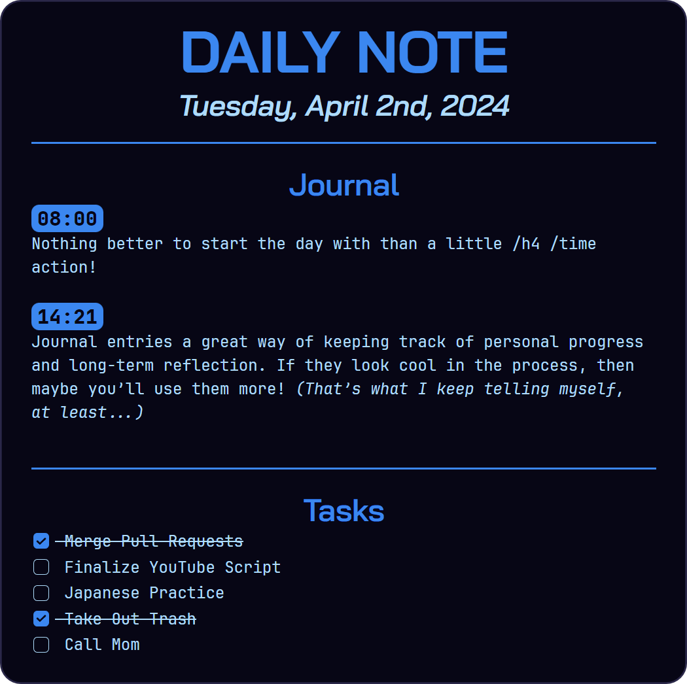

# Obsidian-Daily-Themes v1.1.0
## A Series of Daily Theme CSS Snippets for Obsidian.

These are a set of 7 main CSS classes that can be used to apply individual color
schemes to daily notes for each day of the week. These as well as the included template can be used with the [Templater](https://github.com/SilentVoid13/Templater) plugin to create some automatically-themed daily notes inside your Obsidian vault!

***The template references your note's filename to get the date and expects a "YYYYMMDD" naming format!*** If you don't wish to use this format, you could either customize the template using [Moment.js](https://momentjs.com/) formatting, or grab the old version of the template that doesn't rely on the filename, but can only reference the current date [here](https://github.com/CyanVoxel/Obsidian-Daily-Themes/blob/bb1bc8866c18739c3b8a263986496c184a2666a5/(TEMPLATE)%20Daily.md?plain=1).

To customize the colors for each day, just swamp out the colors values under
the main "day of the week" classes.

*NOTE:* By default, this snippet relies on the [Bai Jamjuree](https://fonts.google.com/specimen/Bai+Jamjuree) or
[JetBrainsMono Nerd Font Mono](https://www.jetbrains.com/lp/mono/) fonts. If you don't wish to use these, then just
change or remove those font-family lines from the snippet.
